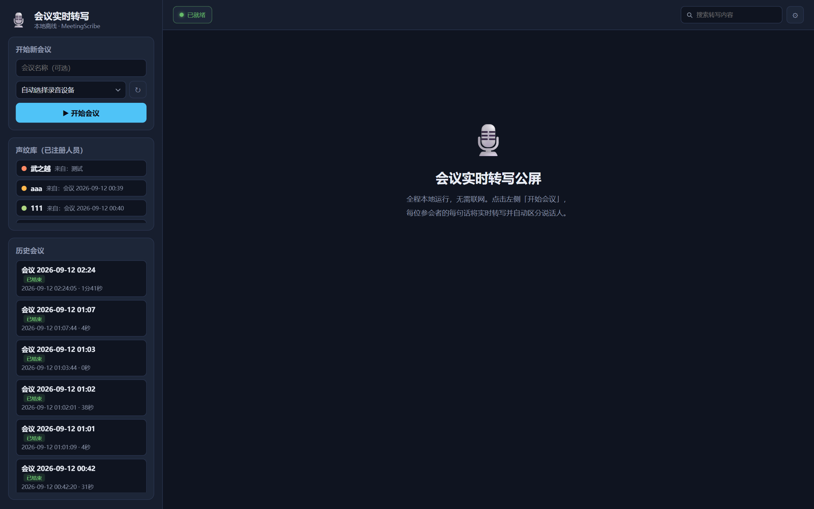
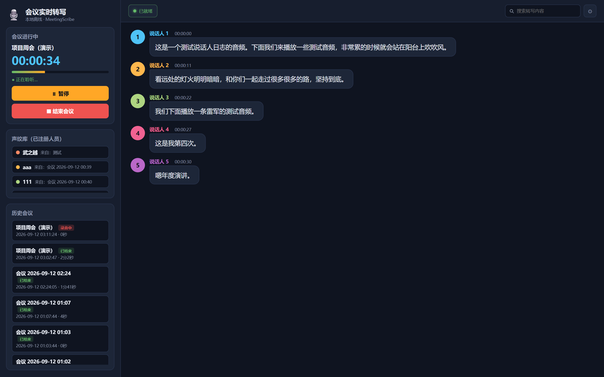
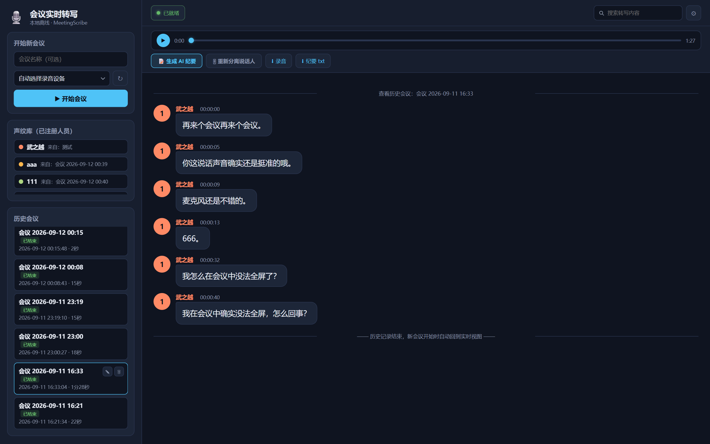
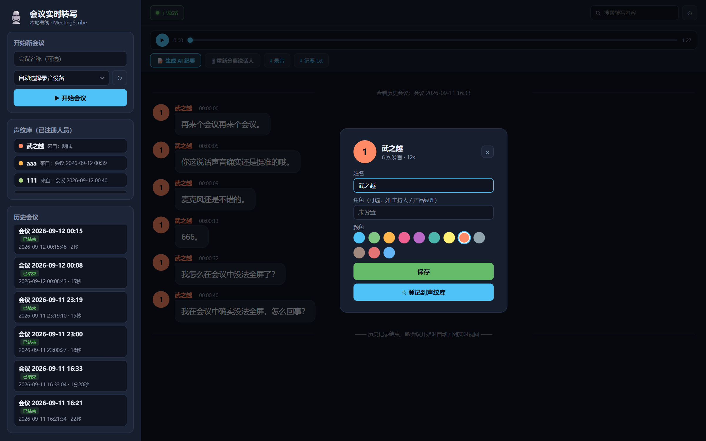
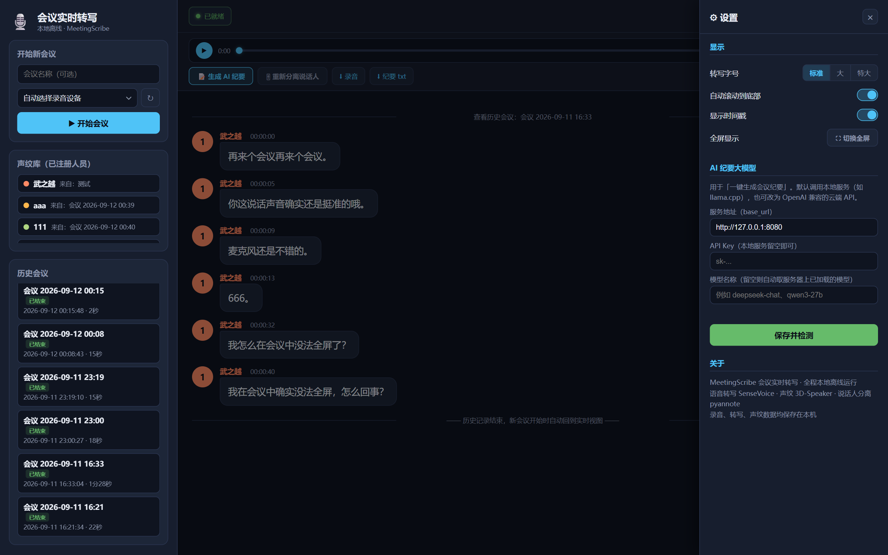

# MeetingScribe · 会议实时转写

**全程本地离线运行的会议实时语音转写系统** —— 边说边转写、自动区分说话人、声纹库实名识别、会议管理、AI 一键生成会议纪要。


> 录音、转写、声纹、会议数据全部保存在本机，**运行时不做任何云端调用**。
> 唯一的联网行为是可选的「AI 纪要」功能，也可以指向本地大模型（llama.cpp）。

## 界面预览

| 主界面 | 会议进行中（实时转写） |
|:---:|:---:|
|  |  |

| 历史会议详情 | 说话人卡片 | 设置 |
|:---:|:---:|:---:|
|  |  |  |

## 功能特性

- **实时转写**：每句话结束约 1 秒内上屏（Silero VAD 断句 + SenseVoice 中文 ASR，带标点与 ITN 数字归一化），CPU 即可流畅运行
- **实时说话人分离**：eres2net 声纹嵌入 + 增量聚类，自动区分「说话人 1/2/3…」，每人独立颜色；长段语音内部做切换点检测，短句不开新说话人防抖
- **会后自动重校正**：结束会议秒回结果，8 秒后在后台用 pyannote segmentation 3.0（int8 ONNX）对整段录音重算说话人时间轴并按重叠度重打标签，远场环境明显提升；已自定义的姓名与颜色自动保留
- **声纹库**：把说话人一键登记为实名人员（取其全部发言的平均声纹），之后每场会议自动识别、直接显示真实姓名；未入库的陌生人仍会聚类为「说话人 N」，可会后再入库
- **说话人卡片**：对话中点击头像或姓名即可弹出 —— 实时改名、设置角色（主持人/产品经理…）、换颜色、登记声纹，会议中和历史会议里都即时生效
- **AI 会议纪要**：一键生成结构化纪要（会议概况 / 讨论要点 / 决议事项 / 行动项表格 / 遗留问题，附时间戳引用），流式渲染，长会议自动分块提取再汇总；支持本地 llama.cpp（默认）或任意 OpenAI 兼容云端 API，界面内直接配置 URL / Key / 模型名
- **会议管理**：开始 / 暂停 / 继续 / 结束；左侧历史会议列表回看，支持改名与删除
- **会议存档**：每场会议自动保存 `audio.wav`（16kHz 全程原始录音）+ `transcript.jsonl`（逐句结构化记录）+ `transcript.txt`（带时间轴文本）
- **录音回听**：历史会议内置播放器与进度条，随时回听；录音 / 纪要 / AI 总结下载走 **Windows 系统保存对话框**（客户端模式）
- **原生桌面客户端**：pywebview + Edge WebView2 内核，无需打开浏览器；窗口最小 800×600 自适应布局，支持全屏
- **公屏工具**：全文搜索高亮、转写字号三档、自动滚动开关、时间戳开关，全部收纳于右侧设置抽屉
- **录音设备管理**：自动识别 reSpeaker 等 USB 麦克风阵列，下拉手动切换，一键刷新新接入设备；模型 / 声纹 / 设备三项自检合并为右上角「已就绪」指示灯

## 安装

前往 [Releases](../../releases) 下载，两种方式任选（均已**内置**便携 Python 运行时与全部本地模型，无需安装任何环境）：

**① 安装包 `MeetingScribe-Setup-x.x.x.exe`（约 290 MB，推荐）**

- 双击一路下一步；安装到用户目录（`%LOCALAPPDATA%\Programs\MeetingScribe`），无需管理员权限
- 可选创建桌面快捷方式，装完即可启动，自带卸载程序

**② 便携版 `MeetingScribe-Portable-x.x.x.zip`（约 283 MB）**

- 解压到任意目录，双击文件夹内的 `启动会议转写.bat` 即可运行
- 不写注册表、不产生系统依赖，删除文件夹即完成卸载；会议数据保存在软件目录 `data/` 下

> Windows SmartScreen 若提示「未知发布者」，点击「仍要运行」即可（个人自签名证书）。

## 使用说明

1. 插入 USB 麦克风（推荐 reSpeaker 系列阵列麦克风，内置降噪与回音消除，远场效果更好；普通笔记本麦克风也能用）
2. 启动「会议转写」，等待右上角变为 **● 已就绪**（模型加载约需几秒）
3. 左侧点击 **▶ 开始会议**，说话即可在公屏看到逐句转写与说话人区分
4. 点击任意说话人头像/姓名 → 改成真实姓名并「登记到声纹库」，下次开会自动识别
5. **⏹ 结束会议** 后自动生成时间轴纪要，可回听录音、生成 AI 纪要、下载存档

## 技术架构（全离线）

```
USB 麦克风阵列（reSpeaker XVF3800 / 内置麦克风）
  → sounddevice 采集 48kHz → soxr 重采样 16kHz
  → Silero VAD 语音端点检测（silero_vad.onnx）
  → eres2net 说话人嵌入 + 实时增量聚类（eres2net_speaker.onnx）
  → SenseVoice int8 中文 ASR（sense-voice.int8.onnx）
  → FastAPI WebSocket → WebView2 前端公屏

会议结束后（后台线程）：
  整段录音 → pyannote segmentation 3.0 int8 重算时间轴
  → 与实时标签按重叠度对齐校正 → 保留实名/颜色写回存档
```

| 组件 | 选型 |
|---|---|
| ASR | SenseVoice Small int8（sherpa-onnx，中英日韩粤） |
| 说话人嵌入 | 3DSpeaker ERes2Net base 200k（中文声纹） |
| VAD | Silero VAD |
| 会后重分离 | pyannote segmentation 3.0（int8 ONNX）+ 谱聚类 |
| 推理引擎 | sherpa-onnx（ONNX Runtime，纯 CPU） |
| 后端 | Python 3.12 + FastAPI + WebSocket |
| 前端 | 原生 HTML/CSS/JS（无构建依赖） |
| 客户端 | pywebview（Edge WebView2 内核） |
| 打包 | Inno Setup 6（可选 signtool 自签名） |

## 从源码运行

```bash
git clone https://github.com/Titor99/MeetingScribe.git
cd MeetingScribe
python -m venv .venv
.venv\Scripts\pip install -r requirements.txt
```

### 下载模型（约 270 MB）

将以下文件放入 `models/` 目录（国内可用 `hf-mirror.com` 加速）：

```bash
# 1. Silero VAD（2 MB）
curl -L -o models/silero_vad.onnx \
  https://github.com/k2-fsa/sherpa-onnx/releases/download/asr-models/silero_vad.onnx

# 2. SenseVoice int8 ASR（228 MB）— HuggingFace: csukuangfj/sherpa-onnx-sense-voice-zh-en-ja-ko-yue-2024-07-17
#    下载 model.int8.onnx → models/sense-voice.int8.onnx
#    下载 tokens.txt      → models/sense-voice-tokens.txt

# 3. ERes2Net 声纹嵌入（38 MB，下载后重命名）
curl -L -o models/eres2net_speaker.onnx \
  https://github.com/k2-fsa/sherpa-onnx/releases/download/speaker-recongition-models/3dspeaker_speech_eres2net_base_200k_sv_zh-cn_16k-common.onnx

# 4. pyannote segmentation 3.0 int8（会后重分离用）
#    HuggingFace: csukuangfj/sherpa-onnx-pyannote-segmentation-3-0
#    下载 model.int8.onnx → models/sherpa-onnx-pyannote-segmentation-3-0/model.int8.onnx
```

### 启动

```bash
# 桌面客户端（推荐，WebView2 原生窗口）
.venv\Scripts\python.exe desktop_app.py

# 或仅启动后端服务，浏览器访问 http://localhost:7100/
.venv\Scripts\python.exe backend\server.py --port 7100
```

首次启动将 `config.example.json` 复制为 `config.json` 即可按需调整参数。

## 打包安装包

```powershell
# 1. 准备便携 Python + 依赖 + 模型到 dist\MeetingScribe（结构见 installer.iss）
# 2. 用 Inno Setup 6 编译
& "C:\Program Files (x86)\Inno Setup 6\ISCC.exe" installer.iss

# 3.（可选）自签名，避免 SmartScreen 拦截提示
powershell -File sign-installer.ps1
```

产物输出至 `installer-output/MeetingScribe-Setup-x.x.x.exe`。

## 配置说明（config.json）

| 参数 | 默认 | 说明 |
|---|---|---|
| `speaker_threshold` | 0.55 | 实时聚类阈值。**同一人被拆成多人→调小；不同人被合并→调大** |
| `speaker_merge_threshold` | 0.52 | 会后全局合并阈值 |
| `voiceprint_threshold` | 0.6 | 声纹库匹配阈值。**已注册人员识别不出→调小；陌生人被误认→调大** |
| `new_speaker_min_duration` | 1.2 | 短于该秒数的语音不新建说话人（短句声纹不稳防抖） |
| `min_silence_duration` | 0.5 | 停顿多少秒视为一句话结束（越小上屏越快） |
| `max_speech_duration` | 15.0 | 单句最长秒数（超时强制切分上屏） |
| `device_keyword` | `reSpeaker` | 自动匹配的录音设备名关键字 |
| `llm.base_url` | `http://127.0.0.1:8080` | LLM 的 OpenAI 兼容地址（本地 llama.cpp 或云端 API） |
| `llm.api_key` | 空 | API 密钥，本地服务留空 |
| `llm.model` | 空 | 模型名，留空自动取服务器已加载模型 |
| `llm.chunk_chars` | 6000 | 转写超过该字数则分块摘要后汇总 |

AI 纪要相关配置也可以在客户端「⚙ 设置」抽屉里直接修改并检测连通性，无需手改文件。

本地大模型启动示例（llama.cpp）：

```bash
llama-server -m "C:\path\to\qwen3.gguf" --port 8080 -c 32768
```

## 目录结构

```
backend/server.py     后端服务（采集 / 识别 / 分离 / 重校正 / 存储 / API）
frontend/             公屏 + 会议管理界面（原生 HTML/CSS/JS）
desktop_app.py        WebView2 桌面客户端入口（窗口管理 / 看门狗 / 保存对话框）
installer.iss         Inno Setup 打包脚本
sign-installer.ps1    安装包自签名脚本
assets/               应用图标
docs/screenshots/     界面截图
models/               本地模型（需自行下载，见上文）
data/meetings/        会议存档（按会议 ID 分目录，运行时生成）
```

## 已知限制

- 多人**同时**说话（重叠语音）时分离效果会下降，这是纯软件方案的共同限制；阵列麦克风的硬件降噪/回音消除有助于缓解
- 说话人分离基于声纹聚类，编号自动分配；实名识别需先在声纹库登记
- 目前仅支持 Windows x64

## License

[MIT](LICENSE) © 2026 Titor99

模型各自遵循其原始许可：SenseVoice（MIT）、Silero VAD（MIT）、pyannote segmentation（MIT）、3DSpeaker ERes2Net（Apache-2.0）。
